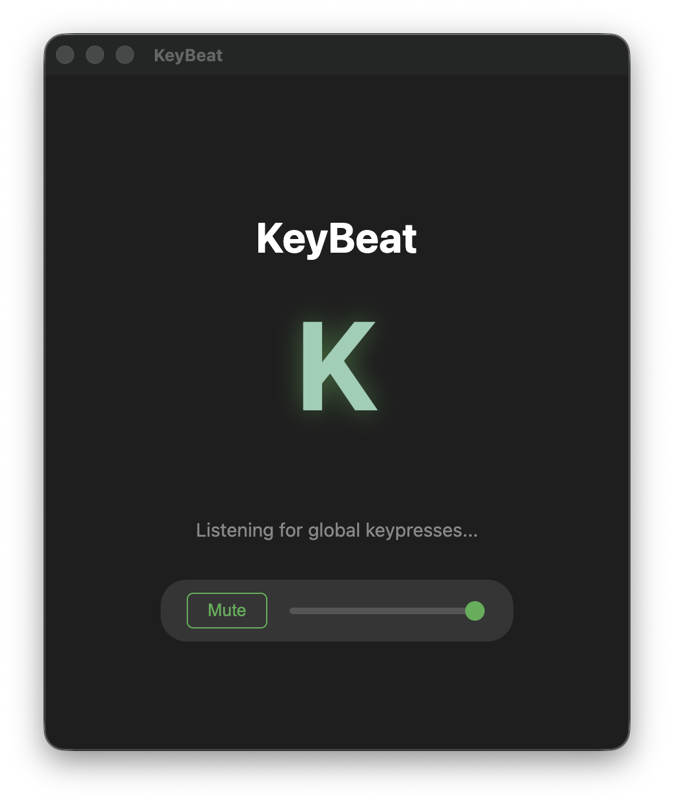

# KeyBeat 🎹

**KeyBeat** is a background Lo-Fi sampler application for macOS. It turns your keyboard into a musical instrument, playing soothing lo-fi piano notes and rhythmic drum sounds as you type, no matter which application is in focus.



## ✨ Features

*   **Global Key Listening**: Works in the background while you type in any app (IDE, Browser, Slack, etc.).
*   **Lo-Fi Aesthetic**: Uses high-quality "Felt Piano" samples in a C Minor Pentatonic scale for a chill, musical vibe.
*   **Rhythm Section**:
    *   **Space**: Kick Drum
    *   **Enter**: Snare Drum
    *   **Backspace**: Hi-Hat
*   **Visual Feedback**: A minimal UI that shows the currently pressed key with dynamic animations.
*   **Tray Support**: Minimizes to the system tray to keep your dock clean.

## 🚀 Installation

### Prerequisites

*   Node.js (v16 or higher)
*   npm (comes with Node.js)
*   Creating a build requires macOS (for `.dmg` target).

### Steps

1.  **Clone the repository** (if applicable) or download the source.

2.  **Install Dependencies**:
    ```bash
    npm install
    ```
    > **Note**: This runs a `postinstall` script to compile `uiohook-napi` specifically for the Electron environment. If this step fails, ensure you have Xcode Command Line Tools installed (`xcode-select --install`).

3.  **Start the Application**:
    ```bash
    npm start
    ```

## ⚠️ Important: Permissions (macOS)

KeyBeat uses `uiohook-napi` to listen for global keystrokes. On macOS, this requires **Accessibility Permissions**.

1.  When you first run the app, macOS might ask for permission.
2.  If not asked, or if keys aren't triggering sounds:
    *   Go to **System Settings** > **Privacy & Security** > **Accessibility**.
    *   Find your Terminal (e.g., iTerm, Terminal) or the compiled `KeyBeat` app in the list.
    *   Toggle the switch to **ON**.
    *   **Restart the application** for changes to take effect.

## 🛠 Development

### File Structure

*   **`main.js`**: exact Electron `main` process. Handles window creation, system tray, and correct lifecycle management.
*   **`renderer.js`**: The `renderer` process. Handles the audio logic (`Howler.js`) and UI animations.
*   **`preload.js`**: Bridges the `uiohook` events from the main process to the renderer process safely.
*   **`sounds/`**: directory containing the `.wav` audio assets.

### Key Mappings

| Key | Sound | Note |
| :--- | :--- | :--- |
| **Space** | Kick Drum | - |
| **Enter** | Snare Drum | - |
| **Backspace** | Hi-Hat | - |
| **A-Z/0-9** | Felt Piano | C Minor Pentatonic (Rotational) |

## 📦 Building

To create a distributable `.dmg` for macOS:

```bash
npm run build
```

This will run `electron-builder` and output the installer in the `dist/` directory.

## 📄 License

ISC
